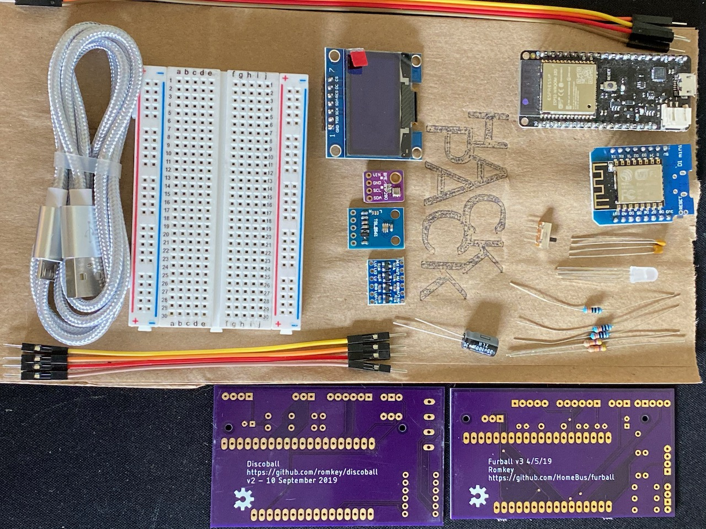
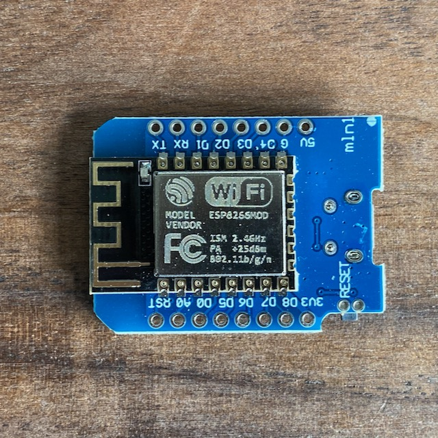

# ESP Hack Pack

 

The ESP Hack Pack contains everything you need to get going on a variety of ESP8266/ESP32 projects.

This includes:
- one (clone) [Wemos D1 mini ESP8266 breakout board](https://docs.wemos.cc/en/latest/d1/d1_mini.html)
- one (clone) [Wemos LOLIN32 ESP32 breakout board]()
- one BME280 I2C air temperature/pressure/humidity breakout board
- one TSL2561 I2C light sensor
- one SH1106 1.3" I2C/SPI OLED display
- one RGB LED
- three 330 ohm resistors (for LED)
- two 47K ohm resistors (for I2C pullups)
- one 100uF capacitor (bypass)
- three 100nF capacitors (bypass)
- one SPDT breadboard-compatible switch

- one small breadboard (optional)
- 12 jumper wires (optional)
- one microUSB cable (optional)

- one [Furball](https://github.com/romkey/furball) printed circuit board
- one [Furball mini](https://github.com/romkey/furball-mini) printed circuit board
- one [Discoball](https://github.com/romkey/discoball) printed circuit board
- one voltage level shifter (bagged)

https://github.com/romkey/esp-workshop

---------------------------

## Overview

### Wemos D1 mini ESP8266 breakout board

 

This is a small, readily available breakout board featuring the Wemos D1 mini. It has 4MB of flash storage and a USB serial port.

The Wemos D1 mini is a 3.3V part. The board has a voltage regulator that allows it to be powered by a 5V source (like the USB port), but the CPU may be damaged by being directly connected to 5V parts. Beware voltage levels if you connect it to an Arduino or a 5V sensor board.

You may need to install a serial driver in order to use this board.

| Windows | |
| macOS | |
| Linux | built-in |

### LOLIN32 ESP32 breakout board

 

The LOLIN32 was commonly available in 2018 but is no longer manufactured and is becoming difficult to find. It has 4MB of flash storage and a USB serial port.

The LOLIN32 is a 3.3V part. The board has a voltage regulator that allows it to be powered by a 5V source (like the USB port), but the CPU may be damaged by being directly connected to 5V parts. Beware voltage levels if you connect it to an Arduino or a 5V sensor board.

You may need to install a serial driver in order to use this board.

| Windows | |
| macOS | |
| Linux | built-in |

### BME280 I2C air temperature/pressure/humidity breakout board

 
  
The BME280 is a sensor chip which measure air temperature, pressure and humidity. It's useful for weather stations and environmental monitoring. The BME280 is well supported, with many drivers and breakout boards available.

The BME280 uses the I2C bus to connect to a processor. I2C is a four wire bus, with power, ground, data and clock lines. Multiple I2C devices can be chained together on one bus.

### TSL2561 I2C light sensor

 

The TSL2561 is a sensor chip wihch measures light intensity. It's useful for environment monitoring. It's well supported with many drivers and breakout boards available.

The TSL2561 uses the I2C bus to connect to a processor. I2C is a four wire bus, with power, ground, data and clock lines. Multiple I2C devices can be chained together on one bus.

### SH1106 1.3" I2C/SPI OLED display

 
 

### RGB LED

 
 
### 330 ohm resistors

 
 
### 47K ohm resistors

 
 
### 100uF capacitor

 
 
### 100nF capacitors

 
 
### SPDT switch

 
 
