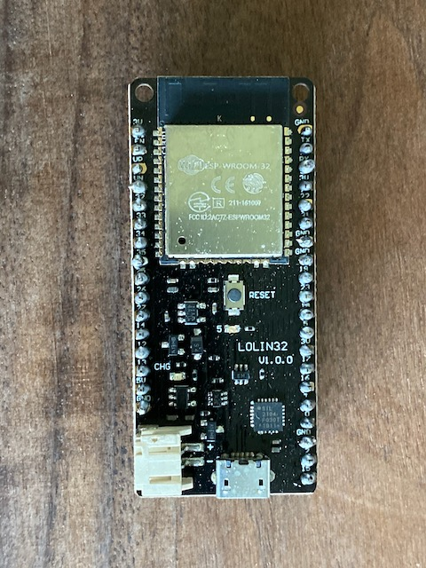
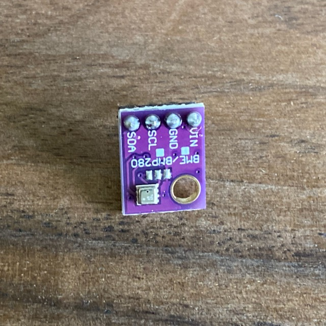
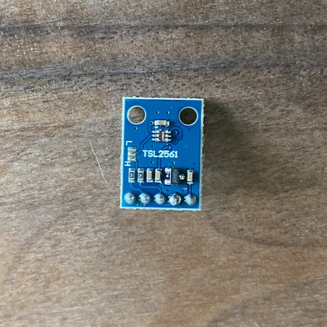
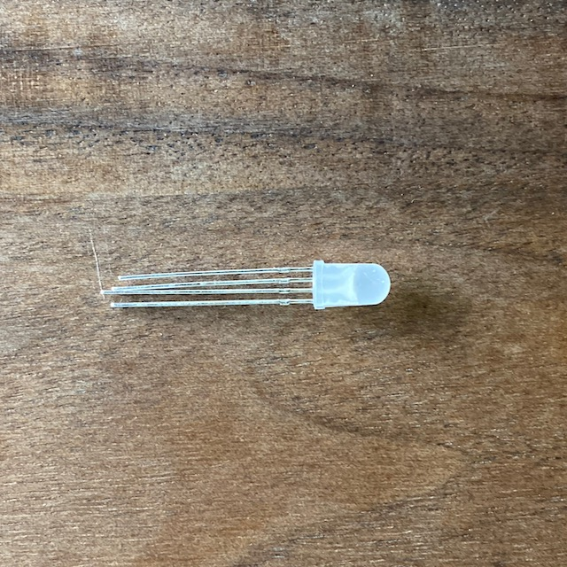
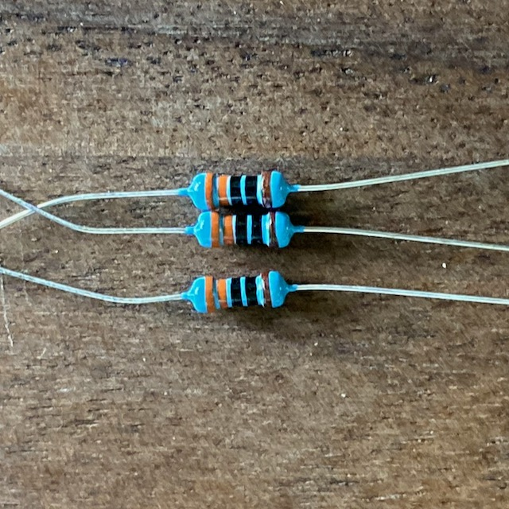
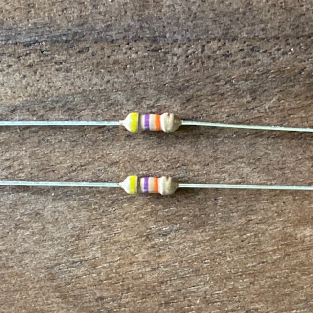
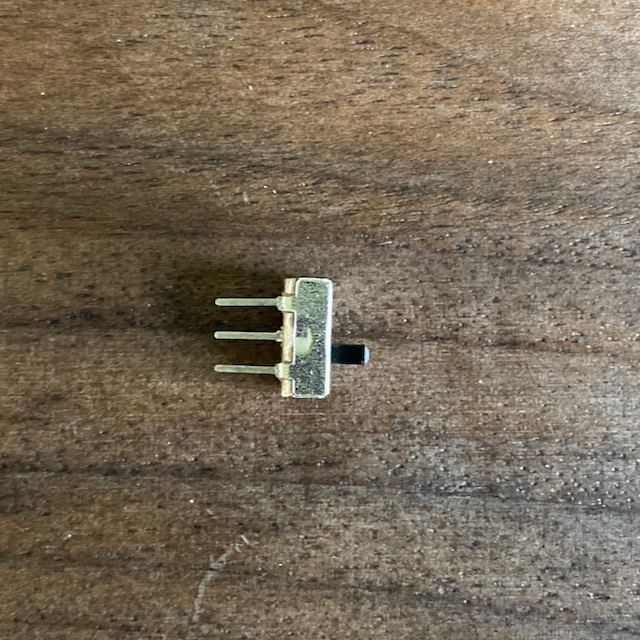

# ESP Hack Pack

 

The ESP Hack Pack contains everything you need to get going on a variety of ESP8266/ESP32 projects.

This includes:
- one (clone) [Wemos D1 mini ESP8266 breakout board](https://docs.wemos.cc/en/latest/d1/d1_mini.html)
- one (clone) [Wemos LOLIN32 ESP32 breakout board]()
- one BME280 I2C air temperature/pressure/humidity breakout board
- one TSL2561 I2C light sensor
- one SH1106 1.3" I2C/SPI OLED display
- one RGB LED
- three 330 ohm resistors (for LED)
- two 47K ohm resistors (for I2C pullups)
- one 100uF capacitor (bypass)
- three 100nF capacitors (bypass)
- one SPDT breadboard-compatible switch

- one small breadboard (optional)
- 12 jumper wires (optional)
- one microUSB cable (optional)

- one [Furball](https://github.com/romkey/furball) printed circuit board
- one [Furball mini](https://github.com/romkey/furball-mini) printed circuit board
- one [Discoball](https://github.com/romkey/discoball) printed circuit board
- one voltage level shifter (bagged)

https://github.com/romkey/esp-workshop

---------------------------

## Overview

### Wemos D1 mini ESP8266 breakout board

 

This is a small, readily available breakout board featuring the Wemos D1 mini. It has 4MB of flash storage and a USB serial port.

The Wemos D1 mini is a 3.3V part. The board has a voltage regulator that allows it to be powered by a 5V source (like the USB port), but the CPU may be damaged by being directly connected to 5V parts. Beware voltage levels if you connect it to an Arduino or a 5V sensor board.

You may need to install a serial driver in order to use this board.

| Windows | |
| macOS | |
| Linux | built-in |

### LOLIN32 ESP32 breakout board

 

The LOLIN32 was commonly available in 2018 but is no longer manufactured and is becoming difficult to find. It has 4MB of flash storage and a USB serial port.

The LOLIN32 is a 3.3V part. The board has a voltage regulator that allows it to be powered by a 5V source (like the USB port), but the CPU may be damaged by being directly connected to 5V parts. Beware voltage levels if you connect it to an Arduino or a 5V sensor board.

You may need to install a serial driver in order to use this board.

| Windows | |
| macOS | |
| Linux | built-in |

### BME280 I2C air temperature/pressure/humidity breakout board

 
  
The BME280 is a sensor chip which measure air temperature, pressure and humidity. It's useful for weather stations and environmental monitoring. The BME280 is well supported, with many drivers and breakout boards available.

The BME280 uses the I2C bus to connect to a processor. I2C is a four wire bus, with power, ground, data and clock lines. Multiple I2C devices can be chained together on one bus.

### TSL2561 I2C light sensor

 

The TSL2561 is a sensor chip wihch measures light intensity. It's useful for environment monitoring. It's well supported with many drivers and breakout boards available.

The TSL2561 uses the I2C bus to connect to a processor. I2C is a four wire bus, with power, ground, data and clock lines. Multiple I2C devices can be chained together on one bus.

### SH1106 1.3" I2C/SPI OLED display

 
 

### RGB LED

 
 
### 330 ohm resistors

 

These resistors are used to limit the current that the RGB LED draws, to avoid burning it out or burning damaging the CPU driving it.

Resistors are not polarized - it doesn't matter which end you plugin on which side. 

There are three of the resistors, which should all look identical. They have the color bands 

See also [Why Do Resistors Have A Color Code?](https://hackaday.com/2020/01/13/why-do-resistors-have-a-color-code/) 

### 47K ohm resistors

 

These resistors are used as "pull-up" resistors, to help stabilize signals on I2C SDA and SCL lines. These lines are driven by pins on the processor which don't connect to a high voltage for high. Connecting SDA and SCL to 3.3V through a resistor will improve the reliabilty of those signals, although circuits will often work without pull-up resistors. You only need them once, although many breakout boards have pull-up resistors integrated on them. Having multiple resistors generally doesn't do any harm.

Resistors are not polarized - it doesn't matter which end you plugin on which side.  
 
There are two of these resistors, which should look identical. They have the color bands 
 
See also [Why Do Resistors Have A Color Code?](https://hackaday.com/2020/01/13/why-do-resistors-have-a-color-code/) 

### 100uF capacitor

 
 
This is a "bypass capacitor".

This capacitor is polarized - it *does* matter which end you plugin on which side. Look for the side marked with the big minus sign; that side should go to ground (or the lower voltage).

### 100nF capacitors

 

These capacitors are not polarized - it doesn't matter which end you plugin on which side. 
 
### SPDT switch

 

### Furball, Furball mini and Discoball printed circuit boards

These boards are extras. We won't be using them during the workshop. If you'd like to commit your D1 mini or LOLIN32 to run some sensors, you can easily solder them into one of these boards and have a more permanent device than you would with the breadboard.

#### Furball

The Furball uses the LOLIN32 and has connections for the BME280 and TSL2561 breakout boards. It can also accept a BME680 breakout, which is an upgrade from the BME280 that also reads volatile organic compounds in the air, to help measure air quality.

The Furball can also use a PIR sensor to detect occupancy (presence), a PMS5003 dust particle sensor for air quality, and an audio sensor for sound levels (software for this has never worked correctly).

If you'd like to learn more, check out its repository at https://github.com/romkey/furball or feel free to ask me about it. 

#### Furball mini

The Furball uses the D1 mini and has connections for the BME280 and TSL2561 breakout boards. It can also accept a BME680 breakout, which is an upgrade from the BME280 that also reads volatile organic compounds in the air, to help measure air quality.

The Furball mini can also use a Dallas 1 wire temperature waterproof sensor and a PMS5003 dust particle sensor for air quality.

If you'd like to learn more, check out its repository at https://github.com/romkey/furball-mini or feel free to ask me about it.

#### Discoball

The Discoball controls strips of individually addressable RGB LEDs. These are different from the RGB LED included in the HackPack - these LEDs each have their own controller chip, which can be connected to another RGB LED allowing you to create strands or strips of LEDs that can be controlled individually.

The Discoball uses the LOLIN32 and has an optional connection for the BME280 breakout board. We use one of thse inside the PDX Hackerspace vending machine; the BME280 monitors the temperature inside the machine.

The Discoball uses the level shifter board included in the Hack Pack. Most LEDs operate at 5V; the level shifter allows the LOLIN32 to properly drive them.

If you'd like to learn more, check out its repository at https://github.com/romkey/discoball or feel free to ask me about it. 
